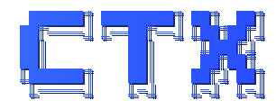

<!-- README = the top of the funnel: convince. The how-to-use (Tutorial/How-to/Explanation) lives in docs/GUIDE.md. -->

<div align="center">

<picture>
  <source media="(prefers-color-scheme: dark)" srcset=".github/logo-dark.svg">
  <source media="(prefers-color-scheme: light)" srcset=".github/logo-light.svg">
  
</picture>

<p><b>The context layer that converges messy multi-session agent work into one buildable source of truth.</b></p>

[![License: MIT][license-shield]][license-url]
[![Agent Skills][skills-shield]][skills-url]

<a href="#quick-start">Quick start</a> &middot;
<a href="docs/GUIDE.md">Guide</a> &middot;
<a href="#the-idea-in-one-breath">How it works</a> &middot;
<a href="#the-skills">Skills</a>

</div>

---

You run agents across many sessions. Every session leaves notes, decisions, half-plans, dated research. Then context compacts, a new session starts, and the thread is gone — you can't tell what's still true, what was decided, or what to build. Your docs don't just sprawl; they **rot**.

ctx is a small set of agent skills that keep a project's context in **one living source of truth that survives every session** — so an agent (or a human three months later) can open it and build, without re-deriving what you already decided.

> It looks like "a way to organize a folder." It's really a discipline for **not losing the truth of your project** as it grows.

## Why it exists — the pain → the job

- **You lose the thread when context compacts.** → ctx keeps one buildable source of truth (`spec/` + `decisions/`) that a fresh session reads in minutes.
- **You can't tell a decision from a stale note from a scratch file.** → ctx sorts every doc by **lifetime** — living / append-only / disposable — so what's current, what's history, and what's throwaway are never confused.
- **Your agent asks you to pick, instead of deciding.** → `ctx-report` exhausts what it can research first, converges to one ranked recommendation, and only asks you the part that's genuinely your call — never a blank "you decide."
- **Reports and explanations pile up into a second mess.** → In ctx they're **disposable**: written for a human to decide from, distilled into the source of truth, then archived. The truth stays lean.
- **Your secrets can't ship with your open-source code.** → ctx's context folder can live *outside* the published repo (a gitignored symlink) while the agent still finds it at `/ctx`.

## What you get

- **Lifetime layout, not stage layout** — folders that tell you the one thing you need to act: edit in place, never rewrite, or throw away. No stale doc left at every pipeline stage.
- **A generative source of truth** — only `spec/` + `decisions/` are truth; every report, tutorial, or comparison is derived on demand and discarded. The base stays lean by construction.
- **Convergence, not a wiki** — messy multi-session exploration pulled *into* one truth you build from, instead of a divergent pile of articles that grows sideways.
- **Decision-forcing, not option-dumping** — a report exhausts what's researchable, converges to one ranked recommendation, and escalates only your genuinely private call — never a menu with no pick attached.
- **Zero-disruption onboarding** — point it at an existing repo; it proposes a layout and a migration plan and touches nothing until you approve. Your code and directories are never restructured.
- **Ships clean** — the context can live in an external `<project>-ctx` store (a gitignored symlink) so nothing private leaves with public code.
- **Survives handoff** — a cross-session progress node tells the next session where you are, what's next, and what to read first.

## When to use it — and not

**Use it when** you are:
- starting or restructuring a project's design / knowledge docs
- converging a pile of dated research into one truth
- unsure where a finding belongs (spec vs decision vs scratch)
- staring at docs that have drifted into redundant, contradictory, stale piles
- onboarding a messy existing repo

**Not for:** a throwaway script, a repo with no design/decision surface, or single-session work that never hands off.

## Quick start

```bash
npx skills add motiful/ctx --all
```

Then, in your project, just tell your agent what you want in plain language. ctx routes each ask to the right skill:

| Say this to your agent… | …and ctx does |
|---|---|
| **"apply ctx to this repo"** | inspects the repo, proposes where `/ctx` lives, sorts scattered docs, hands you a migration plan — nothing moves until you approve *(ctx-adopt)* |
| **"set up ctx for this new project"** | scaffolds the lifetime skeleton (`spec/ decisions/ progress/ reports/ scratch/`) and seeds the source of truth *(ctx)* |
| **"record this: we chose X over Y because Z"** | writes an append-only ADR with the reason into `decisions/` *(ctx-spec)* |
| **"merge these notes into the spec"** | extracts atomic conclusions, routes each to one home via a visible ledger, surfaces conflicts as choices *(ctx-merge)* |
| **"where does this finding go — spec, decision, or scratch?"** | classifies it by lifetime and files it in exactly one place *(ctx)* |
| **"write me a report to decide from"** | produces a disposable HTML report that ends by asking for your verdict, then distills the keepers into the truth *(ctx-report)* |
| **"our docs have drifted — reconcile them"** | finds redundant / contradictory / stale docs and converges them to one source *(ctx-merge)* |
| **"this code change alters behavior — sync the docs"** | updates the owning spec/ADR in the same change; drift is treated as a defect — the cross-cutting rules every ctx skill applies before committing |
| **"keep the dev server running across my sessions"** | hosts it detached in tmux so parallel sessions share one instance and it survives a reset; records the topology in a committed `services.md` *(ctx-serve)* |
| **"I'm about to /compact — checkpoint first"** | sweeps everything decided this session into progress + decisions + spec, verifies the indexes, confirms nothing is left only in chat *(ctx-compact)* |

**Ready to actually use it? → [docs/GUIDE.md](docs/GUIDE.md)** — the 5-minute tutorial, the how-do-I recipes, and why it's shaped this way.

## The idea, in one breath

Two moves carry the whole thing:

1. **Organize by LIFETIME, not by pipeline stage.** Stage folders (requirements → research → design → …) leave a stale doc at every stage. Lifetime folders don't: **LIVING** (edit in place) / **APPEND-ONLY** (history, never rewritten) / **DISPOSABLE** (archived aside).
2. **The source of truth is GENERATIVE.** `spec/` + `decisions/` are the only truth; every report, explanation, or option-comparison is derived *from* them on demand and thrown away. That is what keeps the base lean instead of turning into a wiki.

This is **convergence** (messy exploration → one truth), not a wiki (a divergent pile of articles).

## The skills

One primary you talk to (`ctx`), seven companions it routes to — five document skills, plus one operational (`ctx-serve`) and one meta (`ctx-compact`).

| Skill | The job it does |
|---|---|
| **ctx** | Entry + orchestrator. The lifetime model, the generative-SOT model, the `/ctx` folder; classifies each doc and routes to the rest. |
| **ctx-adopt** | Bring an existing (messy) repo under ctx with zero disruption: decide where `/ctx` lives, sort the docs, hand you a plan. |
| **ctx-merge** | Converge many scattered sources into the truth without silently dropping or distorting anything. |
| **ctx-spec** | Write specs + ADRs an agent can actually build from (granularity, EARS acceptance criteria, ADR lifecycle). |
| **ctx-progress** | Track work truth: where we are, what's next, what to read first; cross-session handoff. |
| **ctx-report** | Write a disposable HTML report a human decides from, then distill it into the truth. |
| **ctx-serve** | Host long-running processes (dev servers, watchers) in tmux so they survive a reset and are shared across parallel sessions; record the topology in a committed `services.md`. |
| **ctx-compact** | The pre-reset checkpoint: before `/compact`, sweep everything decided into its SOT home and verify the base is current — so a reset loses nothing. |

The **cross-cutting hard constraints** — single-source · same-change (incl. code↔doc) · verify-against-canonical · the gate — are not a separate skill; they live in a shared reference (`consistency.md`) every skill applies before it commits.

Start with **ctx** — it reads the model and pulls in the others as needed.

## Install

```bash
npx skills add motiful/ctx --all          # whole collection
npx skills add motiful/ctx --skill ctx    # or just the primary + add companions as needed
```

## Feedback & contributing

ctx is young and still evolving — real usage on real projects is the signal that shapes it. If a skill misfires, a doc confuses, or a capability you need isn't there:

- **Open an issue** → [github.com/motiful/ctx/issues](https://github.com/motiful/ctx/issues) — bug reports, rough edges, and "this didn't do what I expected" are all welcome.
- **PRs** — docs fixes and skill refinements are welcome directly. For larger changes, open an issue first so we can align on direction.

## License

MIT — see [LICENSE](LICENSE).

---

<div align="center"><sub>Crafted with <a href="https://github.com/motiful/readme-craft">Readme Craft</a></sub></div>

[license-shield]: https://img.shields.io/badge/License-MIT-blue.svg
[license-url]: LICENSE
[skills-shield]: https://img.shields.io/badge/Agent%20Skills-compatible-8A2BE2.svg
[skills-url]: https://github.com/anthropics/skills
